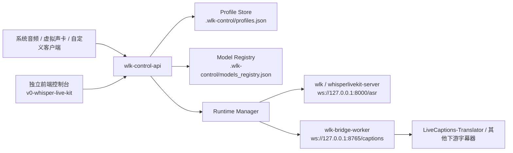

# WhisperLiveKit

WhisperLiveKit 是一个面向实时语音转写、翻译和字幕分发的自托管工具集。

这个仓库在原始 `WhisperLiveKit` 能力之上，增加了更适合 Windows 本地直播链路的控制平面、Bridge 和默认配置，重点场景是：

- 桌面音频 / 虚拟声卡采集
- 日语直播字幕与转写
- 与 `LiveCaptions-Translator` 一类下游显示工具联动
- 本地优先、可控、低延迟的字幕链路

## 这份仓库包含什么

- `wlk` / `whisperlivekit-server`：WhisperLiveKit 实时转写 WebSocket 服务
- `wlk-control-api`：本地控制 API，负责 Profile、模型、前检查和运行管理
- `wlk-bridge-worker`：把本地音频输入转成下游字幕流的 Bridge
- `wlk_control/`：控制平面实现
- `docs/`：模型、集成、故障排查等补充文档

## 架构图



## 推荐工作流

如果你只是想快速体验原始 WLK，可直接启动服务：

```bash
wlk --model large-v3-turbo --language ja --backend-policy localagreement --backend faster-whisper
```

如果你要长期跑本地字幕链路，推荐使用控制平面：

1. 启动 `wlk-control-api`
2. 在控制台里维护 Profile 和模型
3. 通过前检查确认 FFmpeg、模型和音频设备
4. 一键启动 WLK + Bridge
5. 把下游字幕器连到 `ws://127.0.0.1:8765/captions`

## 快速开始

### 1. 安装

```bash
pip install -e .
```

如果你想装已发布版本，也可以：

```bash
pip install whisperlivekit
```

### 2. 启动控制 API

```bash
wlk-control-api --host 127.0.0.1 --port 18700
```

默认控制 API 地址：`http://127.0.0.1:18700/api`

默认会在仓库根目录下创建：

- `.wlk-control/profiles.json`
- `.wlk-control/models_registry.json`
- `.wlk-control/models/`

### 3. 启动前端控制台（可选，但强烈推荐）

前端控制台在单独仓库 `v0-whisper-live-kit`。

它默认连接 `http://127.0.0.1:18700/api`，可以在界面里完成：

- Profile 编辑
- 模型管理
- 启动命令预览
- 实时日志查看
- 日语直播调优参数设置

### 4. 直接启动原始 WLK（不经过控制平面）

```bash
wlk --model large-v3-turbo --language ja --backend-policy localagreement --backend faster-whisper
```

默认 WebSocket 入口：`ws://127.0.0.1:8000/asr`

`GET /` 现在只返回一个简单状态说明，不再自带浏览器录音页面。

## 控制平面默认 Profile

控制平面当前默认的 JP live Profile 重点值如下：

- `model=large-v3-turbo`
- `language=ja`
- `backend_policy=localagreement`
- `backend=faster-whisper`
- `min_chunk_size=0.1`
- `buffer_trimming_sec=4`
- `long-silence-reset-sec=1.5`
- `max-active-no-commit-sec=13`
- `condition-on-previous-text=false`
- `beams=1`
- `no-speech-threshold=0.9`
- `compression-ratio-threshold=2.025`
- `vac-min-silence-duration-ms=200`
- `no-commit-force-sec=1.84`

这组值的目标不是单纯追求最低 CER，而是让直播观感更稳：少串句、少长时间没字、少突然喷大段文本。

## 常用命令

```bash
# 原始转写服务
wlk --model large-v3-turbo --language ja

# 控制 API
wlk-control-api --host 127.0.0.1 --port 18700

# 单独启动 Bridge（一般不需要，控制 API 会负责拉起）
wlk-bridge-worker --help
```

## 可选依赖

| 目标 | 说明 |
| --- | --- |
| `faster-whisper` | Windows / Linux 推荐，用于更快的推理 |
| `mlx-whisper` | Apple Silicon 优化 |
| `nllw` | 实时翻译 |
| `diart` / `nemo` | 说话人分离 |
| `openai` | OpenAI API 后端 |

## 仓库结构

| 路径 | 作用 |
| --- | --- |
| `whisperlivekit/` | 原始转写、流式策略、模型集成 |
| `wlk_control/` | 控制 API、Profile store、模型管理、Bridge 管理 |
| `docs/` | 模型、故障排查、技术集成说明 |
| `.wlk-control/` | 本地运行态数据目录（通常不提交） |

## 文档入口

- 控制平面：`wlk_control/README.md`
- 模型与路径：`docs/default_and_custom_models.md`
- 故障排查：`docs/troubleshooting.md`
- 技术接入：`docs/technical_integration.md`

## 常见排查顺序

1. 先看控制 API 是否存活：`/api/health`
2. 再看前检查是否通过：FFmpeg、模型、端口、CUDA 依赖
3. 再看实际命令预览是否带上了预期参数
4. 再看实时日志，判断是 WLK 还是 Bridge 先出错
5. 如果是 Windows + Faster-Whisper，重点检查 CUDA / cuBLAS / cuDNN 动态库

## 备注

- `.wlk-control/` 下通常包含机器本地路径和设备名，不建议直接提交
- 仓库不再维护内置浏览器录音页和旧的 Chromium 扩展；默认前端改为独立控制台
- 上游原项目首页更偏通用说明；这个 README 更偏当前 fork 的实际使用方式
